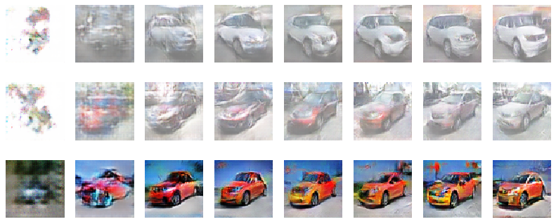

# dcgan-theano
Deep Convolutional Generative Adversarial Networks

## Code structure

* **dcgan.ipynb** Main file to run the experiment
* **dcgan.py** Allows to run the experiments from terminal
* **visualization.ipynb** Provides several functions to visualize the results
* **helper** Set of modules to need to run the code
    * **ImageAugmenter.py** Provides the basic functionality for data augmentation
    * **data_augmenter.py** Abstract ImageAugmenter to provide augmentation methods
    * **image_manipulation.py** Image normalization and generative sampling methods
    * **activation_function.py** Contains activation functions not provided by Theano
    * **data_handler.py** Takes care of creating and loading datasets them 
    * **initialization.py** Creates arrays of random values using several distribution (Normal, Uniform)
    * **layer.py** Network layers implementation (Convolutional, Deconvolutional, Hidden and Logistic)
    * **metrics.py** Score measures, only distance is considered 
    * **network_builder.py** Abstracts the implementation of both network by providing function to create the generator and discriminator
    * **operator.py** Provides several operators such as deconvolution, batch normalization or dropout
    * **optimizer.py** Contains the optimizers used (SGD and Adam)
    * **extract_stl.py** Extracts the STL data and converts it into the desired format

## Running the experiment

It is possible to use the dcgan.ipynb to run the experiments. To analyze the results several functions have been provided in visualization.ipynb.

It is also possible to run the experiment using the command line. To do so run the following command:

```bash
python dcgan.py
```


## Requirements

* Theano
* Scikit-learn
* Scikit-image
* Scipy
* Pillow

## Demonstration



## References

This code is based on the original dcgan code and a dcgan autoencoder. 

[1] https://github.com/Newmu/dcgan_code

[2] https://github.com/mikesj-public/dcgan-autoencoder